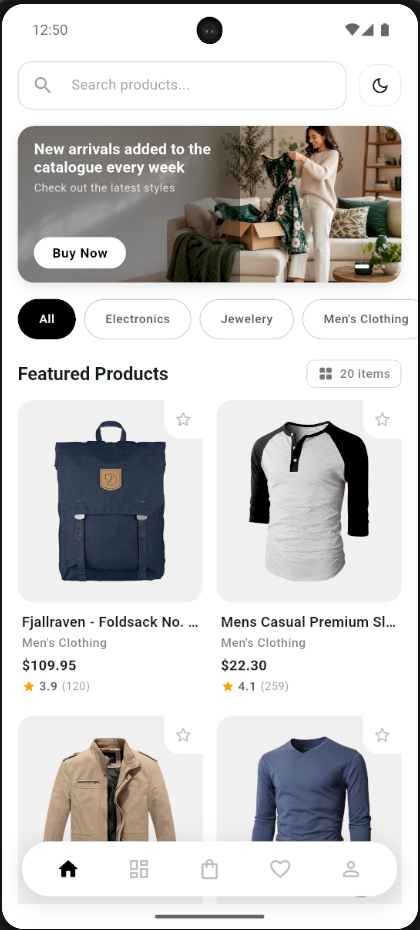
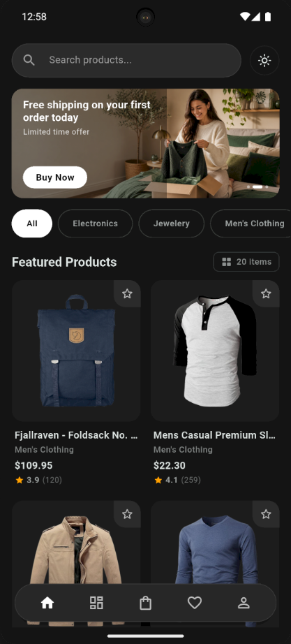
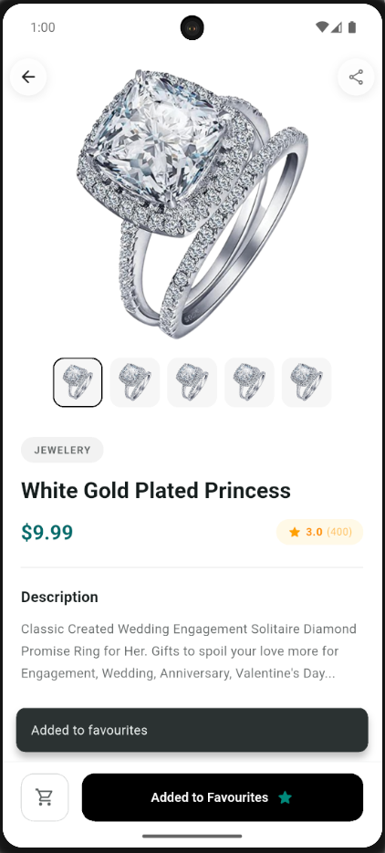
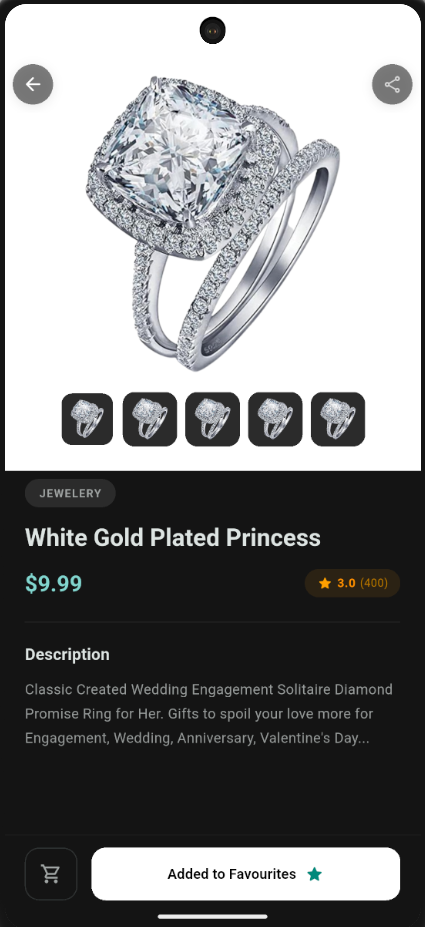

# Product Catalogue Application

Flutter practical assessment project for an Associate Flutter Developer role.

## Project Overview

This application displays a product catalogue loaded from a remote API and lets users:

- browse products in a grid
- search by product name with live substring matching
- view full product details
- add and remove favourites
- persist favourites locally
- switch between light and dark themes

The app also includes loading, error, retry, and empty states for a more complete user experience.

## Screenshots

<table>
  <tr>
    <td align="center">
      <strong>Home Light</strong><br/>
      
    </td>
    <td align="center">
      <strong>Home Dark</strong><br/>
      
    </td>
  </tr>
  <tr>
    <td align="center">
      <strong>Product Details Light</strong><br/>
      
    </td>
    <td align="center">
      <strong>Product Details Dark</strong><br/>
      
    </td>
  </tr>
</table>

## Setup Instructions

### Prerequisites

- Flutter SDK
- Dart SDK
- Android Studio or VS Code with Flutter support
- An emulator, simulator, or physical device

### Install dependencies

```bash
flutter pub get
```

### Run the project

```bash
flutter run
```

### Build an APK

```bash
flutter build apk --release
```

Release output:

```text
build/app/outputs/flutter-apk/app-release.apk
```

## Architecture

### Folder structure

```text
lib/
├── app.dart
├── main.dart
├── core/
│   ├── constants/
│   ├── network/
│   └── theme/
├── features/
│   ├── favourites/
│   │   ├── providers/
│   │   └── services/
│   └── products/
│       ├── models/
│       ├── providers/
│       ├── screens/
│       └── widgets/
```

### State management approach

The app uses `flutter_riverpod`.

- product loading and filtering state are managed through providers
- search text and selected category drive filtered results reactively
- favourites are managed through a `StateNotifier`
- theme mode is also managed through a Riverpod notifier

### API integration approach

- product data is fetched from a remote API through a small network layer in `core/network`
- UI reads products through providers instead of calling the API directly
- failures are surfaced as error states with retry support

## Assumptions

- The Fake Store style product API is acceptable for this assessment.
- Persisting favourite product IDs locally is enough for the bonus persistence requirement.
- Category filtering is treated as an additional UX improvement on top of the required search flow.

## Challenges

- Keeping the list and details screens visually polished without overengineering the app.
- Synchronizing favourite state correctly across multiple screens while persisting it locally.
- Making the promo slider feel smooth and continuous without adding unnecessary package dependencies.
- Improving interaction quality with animations while keeping the UI lightweight.

## Improvements

- Add widget and provider tests.
- Add pull-to-refresh on the catalogue screen.
- Add sorting options such as price, rating, and alphabetic order.
- Improve accessibility with larger tap targets and semantic labels.
- Add screenshots and a demo video directly to the README for submission.

## Assessment Coverage

- Product list screen: implemented
- Product details screen: implemented
- Live search: implemented
- Favourites: implemented
- Favourite persistence: implemented
- State management: implemented with Riverpod
- Light and dark themes: implemented
- Loading, error, retry, and empty states: implemented

